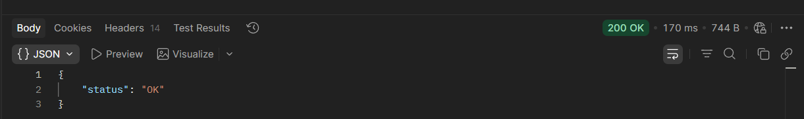

## Status

> Perform status check to confirm that the API is available, working as intended
> and is usable

> Here the edndpoint used is *status*

The HTTP verb used is GET

GET https://simple-books-api.glitch.me/status

 
{
    "status": "OK"
}

