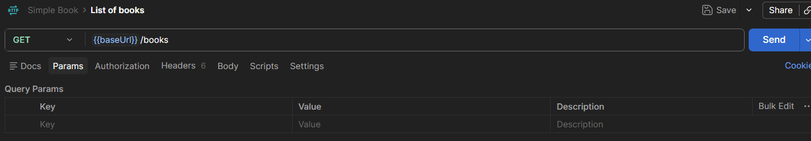
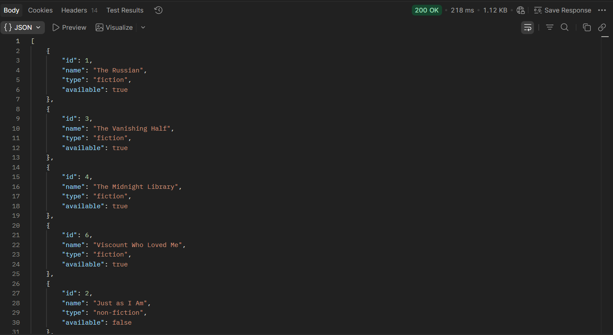
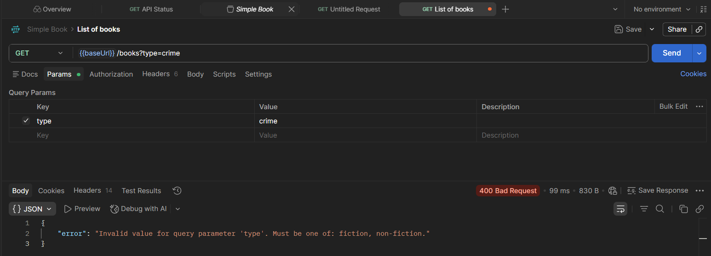
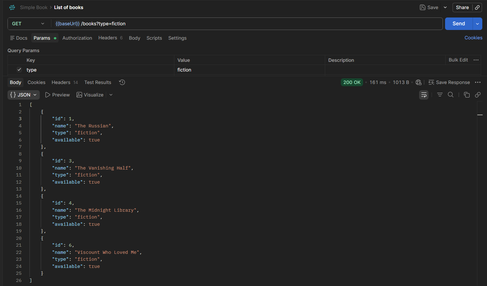

# Endpoint books

The endpoint is books

> The books endpoint returns the list of books
> To get the list of books, use the GET verb 
> 

> Note the use of variable 
> baseUrl is a variable. 
> The API is set as a variable and its value is defined as baseUrl

## Response

> The response body displays the 200 ok status
> This response shows the list of books

## optional query parameters for the `books` endpoint
> type: fiction or non-fiction
> limit: a number between 1 and 20

> Query parameters provide additional data for APIs. 
> Query parameters are either optional or mandatory

> Acceptable value for `type` is fiction or non-fiction. The value used here is `crime` .
> This results in the status 400 bad request

> The error message indicates that either `fiction` or `non-fiction` be used as VALUE
>
> when the VALUE `fiction` is used - 

> Also see the status has now changed to 200 OK